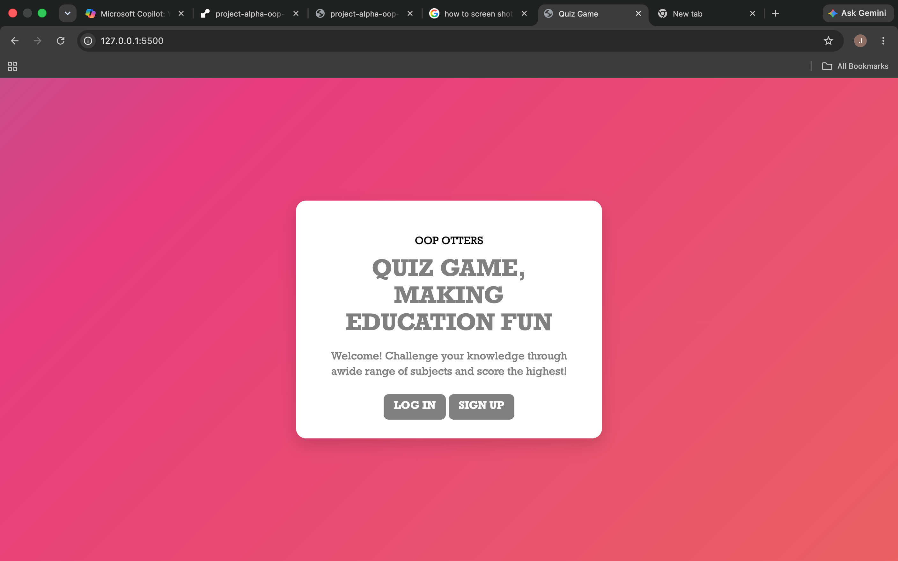

# Project Alpha: OOP Otters Frontend Guide

## Project Overview

This project was created to give students an interactive away to test their knowledge across non-STEM subjects. The aim was to help students with subject material in an engaging way that can ensure learning is fun while being given constant feedback.

## User Requirements

### Requirement Analysis

This project analysed the needs of students and identified the following requirements:

- Allow students to sign up and login to their personal account 
- Give students an easy way to select which subject they want to practice
- Give students an interactive multiple-choice quiz to complete.
- Give students their score and store it so that they can review their results history
- Allow students to retake quizzes

### User Experience

This project aims to proide a user experience that makes learning engaging and fun for students, supported by a frontend connected to an API backend and database.

### Interface Design

The interface design of this project adopts a clean, modern, card-based interface style that utilises a vibrant background colours and simplistic form controls to make it clear what the user is able to do and when.

## System Architecture

This project adopts the MVC backend architecutre as the core technology with the JavaScript-enabled HTML frontend communicating with the PostgresSQL database via the Express API.

## PAge Layout

The frontend includes the following main pages:

Upon clicking the link. Users will be welcomed to the homepage for the quiz game, where they can sign up or log in

.png)
For new users. After clicking the sign up option will be met with a sign up online register. This will require the username to enter a username and password. Prompting the user to enter if any are missing when the form is submitted. Also, the username must be unique to what is stored on the database.

.png)
For existing users. After clicking on the log in option the user will be able to use their username and password to log into the quiz game

Allows users to choose the subject they would like to be quizzed on.

Presents quiz questions and multiple-choice answers for
the selected subject.

Displays the user’s final score, percentage and a breakdown of their answers.

Displays the user’s profile details and a history of their previous quiz results.